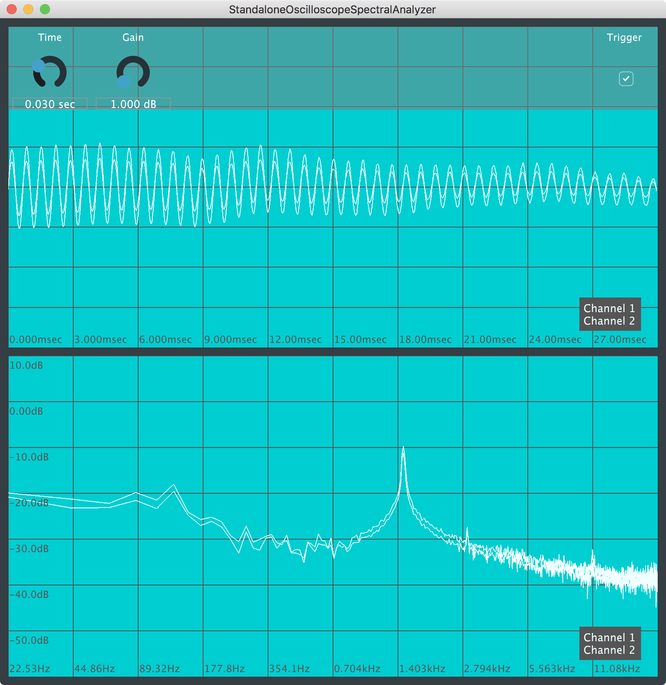

# OpenGLRealtimeVisualization4JUCE

This is a side-product from current work on my Master Thesis I'd like to share with you.

## Basic idea
This repo should contain some classes helping to implement Open GL accelerated JUCE Components that visualize measurements of realtime signals. Motivated through the target application of my Master Thesis special focus was set on the possibility of connecting the GUI Components and the realtime data collection mechanism in different ways, e.g. both running in one application, both running in seperate processes on the same machine or even both running on different Hardware devices connected via Network. Because of this my design always needs a data sink and a data source which are connected over some abstract channel and to which all data collection classes as well as all visualization Components are connected.

Furthermore all visualization Components are designed to (re)store their state through a JUCE ValueTree.

To use it, just add it to your personal modules folder and add it to your Project from within the Projucer. Note that the JUCE OpenGL module is not specified as a dependency to this project because the module is also designed for scenarios where the sender is a GUI-less process maybe even running on an embedded processor without any GUI ressources.

## Currently implemented parts
### GUI Components  

- Oscilloscope
- Spectral Analyzer

### Connection 

- Local sink and source allowing to let both the data collection and visualization take place in the same process

## Next steps

- A Network-Based Connection
- Extending the data collector interfaces to complex valued sample buffers for project internal use
- A 3D surface plot to visualize matrix-based calculations
- Some shared Open GL Context for projects with multiple visualization Components

## Example Project
An example JUCE project of how to set up an oscilloscope and spectral analyser for analyzing two incomming audio channels in a simple JUCE Audio App template based project can be found under
```
examples/StandaloneOscilloscopeSpectralAnalyzer
```

Have fun playing around with it and try out to customize the look!

